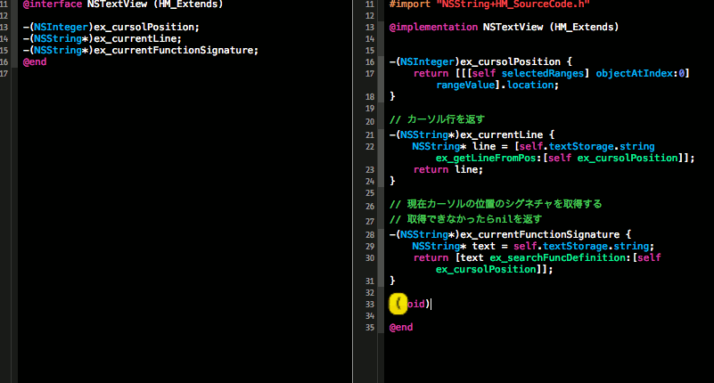

[Japanese](README_jp.md)
# Rakufun 

# Overview
Rakufun is Xcode plugin that generates a method declaration in a header file from a method definition in a sourcefile and generates a method definition in a source file from a method declaration in a header file.

# Usage

## generate method a declaration
 
Move the cursol to method definition in a sourcecode. Then use CTRL+m.
 
## generate method a definition

Move the cursol to method declaration in a header file. Then use CTRL+m.
 
## change CTRL+m

If you want to change the key "CTRL+m", change the value DEFAULT_KEY in RakufunPlugin.m

# Installation

Compile this project. Then restart Xcode.The plugin will automatically be installed in
~/Library/Application Support/Developer/Shared/Xcode/Plug-ins.

To uninstall, just remove the plugin from there. Then restart Xcode.

# License

Copyright (c) 2014 Hiroaki Muronaka
Released under the MIT license

